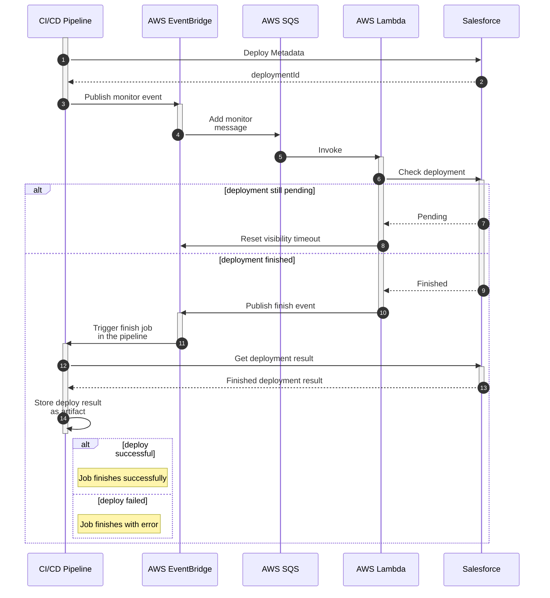

# Salesforce CI/CD Async Deployment Monitor

## The challenge in Salesforce platform

DevOps in Salesforce has its fair share of peculiarities, especially regarding how metadata is dependant on one another and the restrictions the platform imposes over what operations (and in what order) are available when deploying metadata between environments.

The one quirk we want to focus is regarding the fact that once a deployment starts, the local machine that triggers the deployment basically does an upload of the metadata and the rest of the process is mostly handed by the Salesforce instance, leaving the local system no choice but to wait (or poll) for an eventual deployment finish result, which depending on the org complexity could take from a few minutes to several hours. 

When working with popular CI/CD services whos business model is based on minutes consumed per job, we start to see that having a job simply waiting for a long running deployments to complete may not be very profitable. Even when using propietary runners, either cloud or on-prem, are a waste of precious resources in that regard. Therefore leaving a need for other approaches.

## The proposal

For our use case we'll leverage AWS services to bridge the gap between our CI/CD pipeline and Salesforce.

PENDING ARCH DIAGRAM


---

1. Part of the deployment pipeline, via common CI deployment techniques (Ant, SFDX, etc)
2. Fire & Forget, no waiting, will monitor that deployment in AWS
3. Using core CI's [AWS SDK](https://medium.com/hackernoon/monitoring-ci-cd-pipelines-with-amazon-eventbridge-32177e2f2c3e) and [credential actions](https://github.com/aws-actions/configure-aws-credentials) passing the following info in the message:

```json
{
    "repoPath": string,
    "pipelineFinishJobId": string,
    "SFDCdeploymentId": string,
    "SFDCsessionId": string,
    "SFDCorgUrl": string
}
```
The `SFDCdeploymentId` is stored as an artifact to be used in the next job.
The current job finishes and another manual one is avaiable (to be called in step 12).

4. Using EventBridge's [SQS target](https://docs.aws.amazon.com/eventbridge/latest/userguide/eb-targets.html), need to configure the queue's `VisibilityTimeout` to `TICK time` = deployment status polling frequency (for example 10m)
5. [Lambda triggered directly from SQS](https://docs.aws.amazon.com/lambda/latest/dg/with-sqs.html) when visibility timeout has been reached
6. Dynamic callout to `{$SFDCorgURL}/services/data/vXX.0/metadata/deployRequest/{$SFDCdeploymentId}` using `SFDCsessionID` as `Authorization` header
7. Response having `deployResult.status` = (`Pending`, `InProgress`, `Canceling`)
8. Automatically handled by AWS when the Lambda fails (back to step 5)
9. Response having `deployResult.status` = (`Succeeded`, `SucceededPartial`, `Failed`, `Canceled`)
10. Using EventBridge target for [Lambda destinations](https://aws.amazon.com/blogs/compute/introducing-aws-lambda-destinations/), when the function callbacks successfully, passing the `pipelineFinishJobId` attribute.
11. Using [Eventbridge's API destination](https://docs.aws.amazon.com/eventbridge/latest/userguide/eb-api-gateway-target.html) to call the appropriate CI pipeline finish job that was configured as a manual one, using the `repoPath` and `pipelineFinishJobId`.
11.1. [Gitlab way](https://docs.gitlab.com/ee/api/jobs.html#play-a-job) implies directly running the manual job
11.2. [GitHub way](https://docs.github.com/en/actions/managing-workflow-runs/manually-running-a-workflow) seems to not directly suppor manual jobs in an automatic workflow, therefore would imply a separate manual workflow altogether
12. Via SFDX or HTTP callout to get the finished deployment detail using the `/services/data/vXX.0/metadata/deployRequest/deployRequestId?includeDetails=true` endpoint, retrieving the `deployRequestId` from the previously stored artifact.
13. Detail of the deployment is returned
14. Detail is stored as an artifact

Since the manual job is self-contained and self-sufficient (other than requiring the deployment identifier stored from the previous deployment job), it doesn't really need any outside input, therefore if by any chance the deployment is finished and AWS has not invoked the job it could be manually run in the UI or re-run manually as necessary (obviously the job should fail if the deployment is still in progress).

---

The above mentioned architecture could be simplified further when and if Salesforce decides to publish a platform event whe a deployment is finished (see idea), in such case instead of AWS polling the instance on a continuous basis we could leverage the Event Relay functionality so said events are automatically available in EventBridge and therefore trigger the API destination to notify the pipeline.

## Applicability to other platforms / systems

Salesforce platform may not be the only tied to the above mentioned constraints, however the following approach is applicable to other systems that face a similar scenario, AKA "just waiting for long running actions that the caller has nothing to do but wait for the server" to continue.